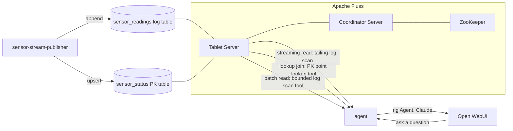

# Real-Time AI Agent

```mermaid
flowchart LR
    subgraph Fluss [Apache Fluss]
        Coordinator[Coordinator Server]
        Tablet[Tablet Server]
        ZooKeeper[ZooKeeper]
    end

    Publisher[sensor-stream-publisher] -->|append| ReadingsLog[(sensor_readings log table)]
    Publisher -->|upsert| StatusTable[(sensor_status PK table)]
    ReadingsLog --- Tablet
    StatusTable --- Tablet
    Tablet --- Coordinator
    Coordinator --- ZooKeeper

    Tablet -->|streaming read: tailing log scan| Agent[agent]
    Tablet -->|lookup join: PK point lookup tool| Agent
    Tablet -->|batch read: bounded log scan tool| Agent
    User[Open WebUI] -->|ask a question| Agent
    Agent -->|rig Agent, Claude| User
```
