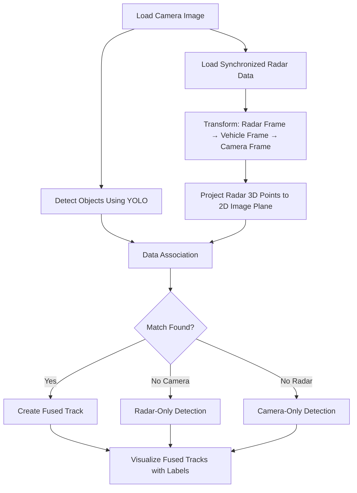

# Camera-Radar Fusion

## Flow

```mermaid
flowchart TD
    A[Load Camera Image] --> B[Detect Objects Using YOLO]
    A --> C[Load Synchronized Radar Data]
    C --> D[Transform: Radar Frame → Vehicle Frame → Camera Frame]
    D --> E[Project Radar 3D Points to 2D Image Plane]
    B --> F[Data Association]
    E --> F
    F --> G{Match Found?}
    G -->|Yes| H[Create Fused Track]
    G -->|No Camera| I[Radar-Only Detection]
    G -->|No Radar| J[Camera-Only Detection]
    H --> K[Visualize Fused Tracks with Labels]
    I --> K
    J --> K
```
