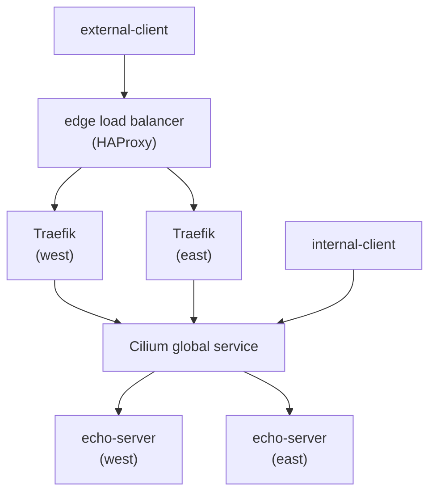

# Cluster Mesh



## Usage

```bash
just kind-up
just install-cilium
just connect-cluster-mesh
just deploy-application
just test-global-service
just test-failover
just apply-network-policy
just test-connectivity

just install-ingress
just deploy-ingress-route
just edge-up
just test-edge
just external-client-up
just test-mesh-failover
just test-edge-failover
```

Tear down with:

```bash
just external-client-down
just edge-down
just kind-down
```
