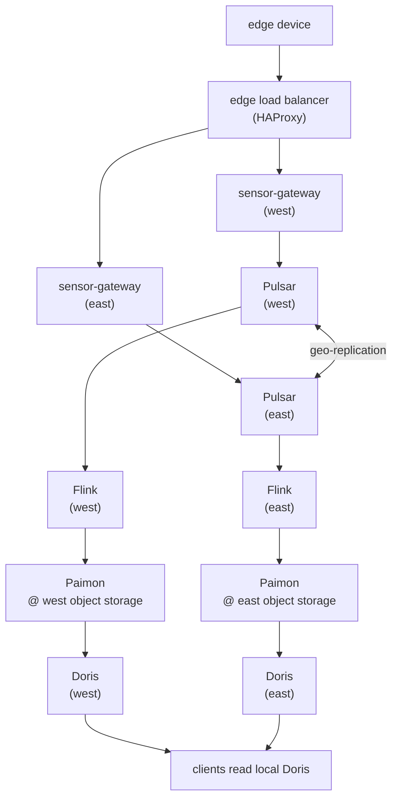

# Multi-Cloud Data Pipeline



## Usage

```bash
just kind-up
just install-cilium
just connect-cluster-mesh
just create-namespace

just install-pulsar
just initialize-geo-replication
just test-geo-replication

just deploy-gateway
just edge-up
just edge-device-up
just test-ingest

just install-rustfs
just install-flink
just submit-telemetry-sink
just paimon-count

just install-doris
just storage-vault-up
just paimon-catalog-up
just deploy-doris-fe-global-service
just doris-count
```

Tear down with:

```bash
just edge-device-down
just edge-down
just kind-down
```
