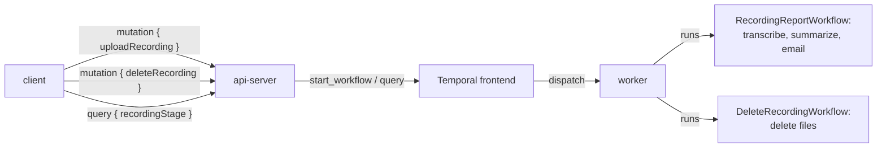

# Temporal

```mermaid
flowchart LR
    Client[client] -->|"mutation { uploadRecording }"| ApiServer[api-server]
    Client -->|"mutation { deleteRecording }"| ApiServer
    Client -->|"query { recordingStage }"| ApiServer
    ApiServer -->|start_workflow / query| Frontend[Temporal frontend]
    Frontend -->|dispatch| Worker[worker]
    Worker -->|runs| Report["RecordingReportWorkflow:<br/>transcribe, summarize, email"]
    Worker -->|runs| Delete["DeleteRecordingWorkflow:<br/>delete files"]
```
