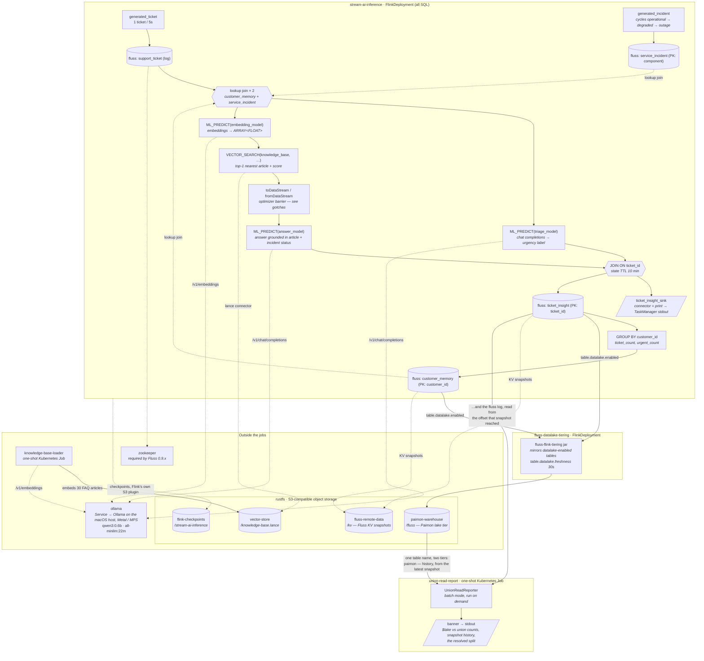

# Stream AI Inference

A walkthrough of the native real-time AI surface Apache Flink 2.x added to SQL / the Table API, plus Apache Fluss as the live memory layer that turns the job's own output into context for its next prediction:

- **`CREATE MODEL`** — registers a remote AI model in the catalog.
- **`ML_PREDICT()`** — a table-valued function (TVF) for streaming, row-level model inference.
- **`VECTOR_SEARCH()`** — a TVF for inline top-k vector similarity search, for real-time RAG.
- **Fluss lookup joins** — a Flink job cannot read its own output back as a dimension table using state alone. Fluss makes it a lookup join.

