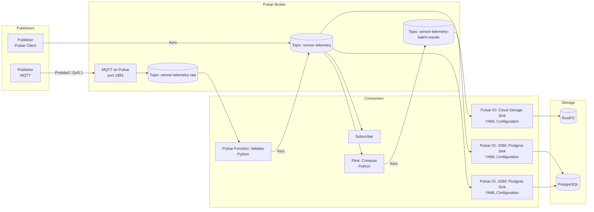

# Sticky Telemetry Stream

```mermaid
flowchart LR
    subgraph Publishers
        mqtt-publisher[Publisher\nMQTT]
        pulsar-publisher[Publisher\nPulsar Client]
    end

    subgraph Pulsar Broker
        mqtt-on-pulsar[MQTT on Pulsar\nport 1883]
        raw-topic[(Topic: sensor-telemetry-raw)]
        telemetry-topic[(Topic: sensor-telemetry)]
        batch-results-topic[(Topic: sensor-telemetry-batch-results)]
    end

    subgraph Consumers
        validate-function[Pulsar Function: Validate\nPython]
        subscriber[Subscriber]
        flink-compute[Flink: Compute\nPython]
        cloud-storage-sink[Pulsar IO: Cloud Storage Sink\nYAML Configuration]
        jdbc-postgres-sink[Pulsar IO: JDBC Postgres Sink\nYAML Configuration]
        jdbc-postgres-sink-batch-results[Pulsar IO: JDBC Postgres Sink\nYAML Configuration]
    end

    subgraph Storage
        rustfs[(RustFS)]
        postgres[(PostgreSQL)]
    end

    mqtt-publisher -->|Protobuf / QoS 1| mqtt-on-pulsar
    mqtt-on-pulsar --> raw-topic
    raw-topic --> validate-function
    validate-function -->|Avro| telemetry-topic

    pulsar-publisher -->|Avro| telemetry-topic

    telemetry-topic --> subscriber
    telemetry-topic --> cloud-storage-sink
    telemetry-topic --> jdbc-postgres-sink
    telemetry-topic --> flink-compute
    flink-compute -->|Avro| batch-results-topic
    batch-results-topic --> jdbc-postgres-sink-batch-results

    cloud-storage-sink --> rustfs
    jdbc-postgres-sink --> postgres
    jdbc-postgres-sink-batch-results --> postgres
```
