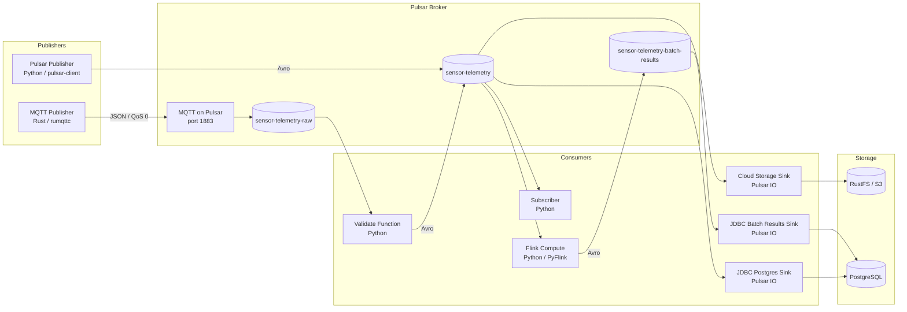

# Sticky Telemetry Stream

```mermaid
flowchart LR
    subgraph Publishers
        mqtt-publisher[MQTT Publisher\nRust / rumqttc]
        pulsar-publisher[Pulsar Publisher\nPython / pulsar-client]
    end

    subgraph Pulsar Broker
        mqtt-on-pulsar[MQTT on Pulsar\nport 1883]
        raw-topic[(sensor-telemetry-raw)]
        telemetry-topic[(sensor-telemetry)]
        batch-results-topic[(sensor-telemetry-batch-results)]
    end

    subgraph Consumers
        validate-function[Validate Function\nPython]
        subscriber[Subscriber\nPython]
        flink-compute[Flink Compute\nPython / PyFlink]
        cloud-storage-sink[Cloud Storage Sink\nPulsar IO]
        jdbc-postgres-sink[JDBC Postgres Sink\nPulsar IO]
        jdbc-batch-results-sink[JDBC Batch Results Sink\nPulsar IO]
    end

    subgraph Storage
        rustfs[(RustFS / S3)]
        postgres[(PostgreSQL)]
    end

    mqtt-publisher -->|JSON / QoS 0| mqtt-on-pulsar
    mqtt-on-pulsar --> raw-topic
    raw-topic --> validate-function
    validate-function -->|Avro| telemetry-topic

    pulsar-publisher -->|Avro| telemetry-topic

    telemetry-topic --> subscriber
    telemetry-topic --> cloud-storage-sink
    telemetry-topic --> jdbc-postgres-sink
    telemetry-topic --> flink-compute
    flink-compute -->|Avro| batch-results-topic
    batch-results-topic --> jdbc-batch-results-sink

    cloud-storage-sink --> rustfs
    jdbc-postgres-sink --> postgres
    jdbc-batch-results-sink --> postgres
```
