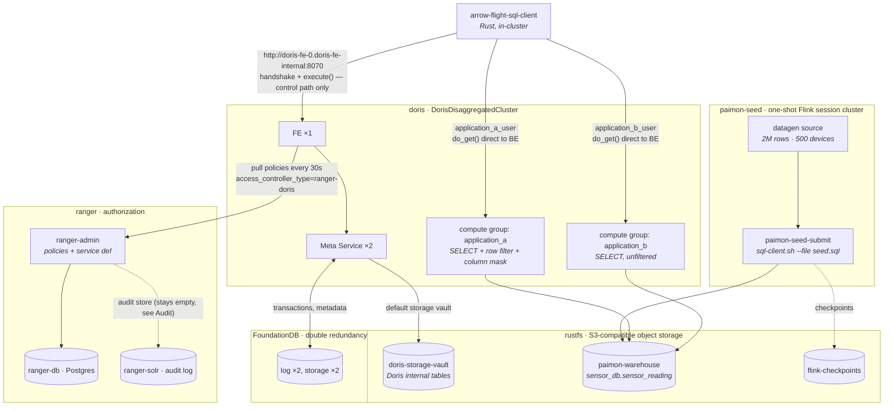

# Storage-Compute Decoupled



## Develop

```bash
just storage-vault-up
just paimon-catalog-up
just ranger-policies-up
just users-up
just same-table-both-groups-application-a
just same-table-both-groups-application-b
just row-filter-and-masking-application-a
just row-filter-and-masking-application-b
```

`ranger-policies-up` has to come before `users-up`, not after it. `users-up` ends with `set property ... default_compute_group`, and Doris checks `USAGE` on that compute group while setting it -- a check Ranger now answers, so without the compute group policies in place it fails with `CURRENT_USER_NO_AUTH_TO_USE_COMPUTE_GROUP`. The policies do not need the Doris users to exist first: Ranger keeps its own user list, populated by the bootstrap Job.

Ranger Admin UI: <http://localhost:6080> (`admin` / `Passw0rd1`).
