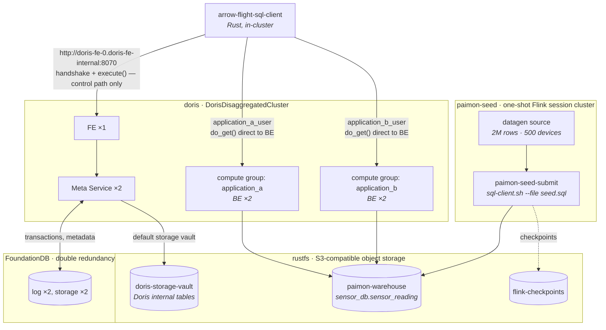

# Storage-Compute Decoupled

```mermaid
flowchart TD
    subgraph rustfs["rustfs · S3-compatible object storage"]
        vault[("doris-storage-vault<br/><i>Doris internal tables</i>")]
        paimonWarehouse[("paimon-warehouse<br/><i>sensor_db.sensor_reading</i>")]
        flinkCheckpoints[("flink-checkpoints")]
    end

    subgraph seed["paimon-seed · one-shot Flink session cluster"]
        datagen["datagen source<br/><i>2M rows · 500 devices</i>"]
        seedJob["paimon-seed-submit<br/><i>sql-client.sh --file seed.sql</i>"]
        datagen --> seedJob
    end

    subgraph fdb["FoundationDB · double redundancy"]
        fdbCluster[("log ×2, storage ×2")]
    end

    subgraph doris["doris · DorisDisaggregatedCluster"]
        ms["Meta Service ×2"]
        fe["FE ×1"]
        applicationACG["compute group: application_a<br/><i>BE ×2</i>"]
        applicationBCG["compute group: application_b<br/><i>BE ×2</i>"]
        ms <-->|transactions, metadata| fdbCluster
        fe --> ms
    end

    client["arrow-flight-sql-client<br/><i>Rust, in-cluster</i>"]

    seedJob --> paimonWarehouse
    seedJob -.->|checkpoints| flinkCheckpoints
    ms -->|default storage vault| vault
    client -->|"http://doris-fe-0.doris-fe-internal:8070<br/>handshake + execute() — control path only"| fe
    client -->|"application_a_user<br/>do_get() direct to BE"| applicationACG
    client -->|"application_b_user<br/>do_get() direct to BE"| applicationBCG
    applicationACG --> paimonWarehouse
    applicationBCG --> paimonWarehouse
```
