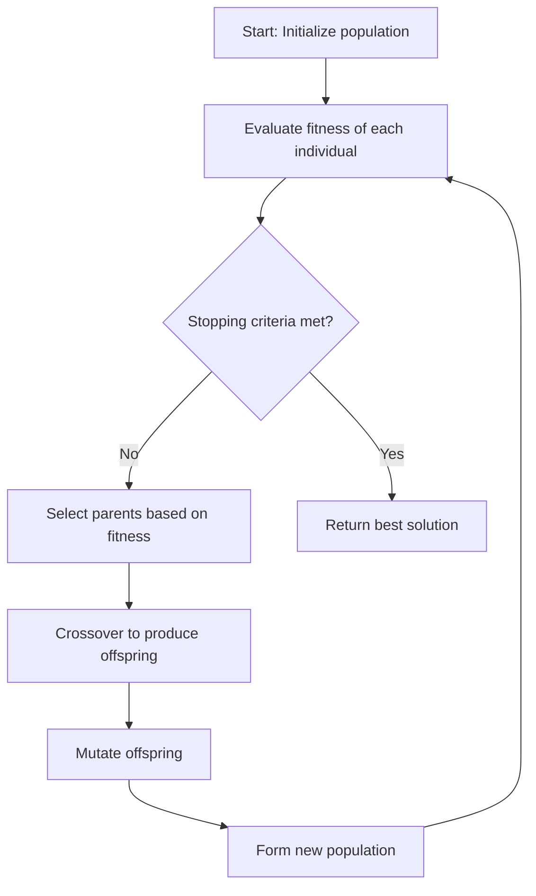

# Genetic Algorithm

## Problem

```math
\max_{x \in [0,1]} f(x) = x \sin(10 \pi x) + 1
```

## Algorithm


```mermaid
flowchart TD
    A[Start: Initialize population] --> B[Evaluate fitness of each individual]
    B --> C{Stopping criteria met?}
    C -- No --> D[Select parents based on fitness]
    D --> E[Crossover to produce offspring]
    E --> F[Mutate offspring]
    F --> G[Form new population]
    G --> B
    C -- Yes --> H[Return best solution]
```
