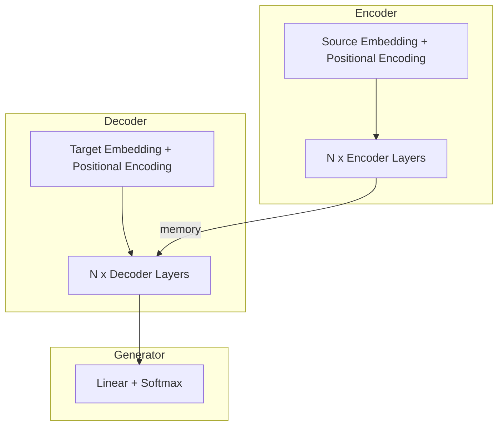

# Dense Transformer

A from-scratch implementation of the Transformer architecture from "Attention Is All You Need" (Vaswani et al., 2017).

References:

- [Attention Is All You Need](https://arxiv.org/abs/1706.03762)

## Architecture Overview

The Transformer uses an encoder-decoder architecture with self-attention mechanisms, eliminating the need for recurrence or convolution.



## Key Components

### Multi-Head Attention

```math
\text{Attention}(Q, K, V) = \text{softmax}\left(\frac{QK^T}{\sqrt{d_k}}\right)V
```

Multi-head attention allows the model to jointly attend to information from different representation subspaces:

```math
\text{MultiHead}(Q, K, V) = \text{Concat}(\text{head}_1, ..., \text{head}_h)W^O
```

### Positional Encoding

Since the Transformer contains no recurrence, positional encodings are added to give the model information about token positions:

```math
PE_{(pos, 2i)} = \sin(pos / 10000^{2i/d_{model}})
```

```math
PE_{(pos, 2i+1)} = \cos(pos / 10000^{2i/d_{model}})
```

### Encoder Layer

Each encoder layer consists of:

1. Multi-head self-attention
2. Position-wise feed-forward network
3. Layer normalization and residual connections

```math
\text{output} = \text{LayerNorm}(x + \text{SelfAttention}(x))
```

```math
\text{output} = \text{LayerNorm}(x + \text{FFN}(x))
```

### Decoder Layer

Each decoder layer consists of:

1. Masked multi-head self-attention (causal mask prevents attending to future tokens)
2. Multi-head cross-attention (attends to encoder output)
3. Position-wise feed-forward network
4. Layer normalization and residual connections

## Implementation Details

| Component                 | Description                                        |
| ------------------------- | -------------------------------------------------- |
| Embedding dimension       | Configurable (default: 512)                        |
| Number of heads           | Configurable (default: 8)                          |
| Number of layers          | Configurable (default: 6)                          |
| Feed-forward dimension    | 4x embedding dimension                             |
| Normalization             | Pre-norm or post-norm                              |
| Positional encoding       | Fixed (sinusoidal) or learnable                    |
| Weight tying              | Generator shares weights with target embedding     |

## Learning Rate Schedule

The implementation supports two learning rate schedules:

1. **Original Transformer schedule**: Warmup followed by inverse square root decay
2. **Cosine schedule with warmup**: Linear warmup followed by cosine annealing

## Example: Copy Task

The `main.py` demonstrates training on a toy copy task where the model learns to reproduce the input sequence:

```text
Input:  [0, 1, 2, 3, 4, 5, 6, 7, 8, 9]
Target: [0, 1, 2, 3, 4, 5, 6, 7, 8, 9]
```

The training runs both pre-norm and post-norm variants to demonstrate their differences.
