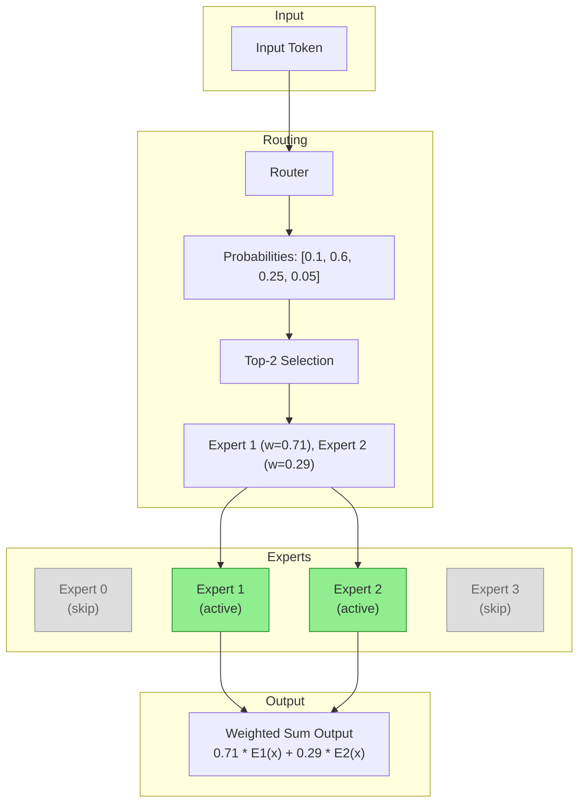

# Mixture of Experts (MoE)

Based on the paper [Outrageously Large Neural Networks: The Sparsely-Gated Mixture-of-Experts Layer](https://arxiv.org/abs/1701.06538) by Shazeer et al. (2017).

## Core Idea

Mixture of Experts (MoE) is a neural network architecture that uses **conditional computation** - only a subset of parameters are activated for each input. Instead of one large network processing everything, MoE has multiple specialized "expert" networks, and a "router" (gating network) decides which experts to use for each input token.

## Intuition

| Dense Model (like a generalist doctor) | MoE (like a hospital with specialists) |
| --- | --- |
| One network processes all inputs | Multiple expert networks, each specialized |
| All parameters activated every time | Only top-k experts activated per token |
| Computation scales with model size | Computation scales with active experts only |
| 100B parameters = 100B FLOPs | 100B parameters but only ~10B FLOPs |

Think of it like a hospital: instead of one doctor knowing everything, you have specialists (cardiologist, neurologist, etc.) and a receptionist (router) who directs patients to the right specialists.

## The Math

### Router (Gating Network)

The router computes which experts to use for each token:

```math
G(\mathbf{x}) = \text{Softmax}(\mathbf{W}_g \mathbf{x})
```

- $\mathbf{x}$: Input token embedding
- $\mathbf{W}_g$: Router weight matrix
- $G(\mathbf{x})$: Probability distribution over experts

### Top-k Expert Selection (Token Choice Routing)

This implementation uses **Token Choice** routing: each token selects its top-k experts.

Select the top-k experts with highest probabilities:

```math
\text{TopK}(G(\mathbf{x}), k) = \{(i, g_i) : i \in \text{argmax}_k G(\mathbf{x})\}
```

Normalize the selected weights:

```math
w_i = \frac{g_i}{\sum_{j \in \text{TopK}} g_j}
```

| Routing Strategy | How it works | Trade-off |
| --- | --- | --- |
| **Token Choice** (this implementation) | Each token selects top-k experts | Every token gets output, but experts may be imbalanced |
| Expert Choice | Each expert selects top-k tokens | Perfect load balance, but some tokens may be dropped |

Token Choice is used because every token must produce an output in language models. The load balancing loss helps mitigate the imbalance problem.

### MoE Layer Output

The final output is a weighted combination of selected expert outputs:

```math
\mathbf{y} = \sum_{i \in \text{TopK}} w_i \cdot E_i(\mathbf{x})
```

- $E_i(\mathbf{x})$: Output of expert $i$
- $w_i$: Normalized weight for expert $i$

### Load Balancing Loss

Without regularization, the router might collapse to using only 1-2 experts. The auxiliary load balancing loss encourages even expert utilization:

```math
\mathcal{L}_{\text{balance}} = N \cdot \sum_{i=1}^{N} f_i \cdot p_i
```

where:

- $N$: Number of experts
- $f_i$: Fraction of tokens routed to expert $i$
- $p_i$: Mean routing probability to expert $i$

| Scenario | $f_i$ | $p_i$ | $\mathcal{L}_{\text{balance}}$ |
| --- | --- | --- | --- |
| Perfect balance (4 experts) | 0.25 each | 0.25 each | $4 \times 4 \times 0.0625 = 1.0$ |
| Complete collapse (1 expert) | 1, 0, 0, 0 | 1, 0, 0, 0 | $4 \times 1 = 4.0$ |

The total loss combines task loss and balance loss:

```math
\mathcal{L}_{\text{total}} = \mathcal{L}_{\text{task}} + \alpha \cdot \mathcal{L}_{\text{balance}}
```

where $\alpha$ is the `load_balance_weight` (typically 0.01).

## Implementation

### Expert Network

Each expert is a simple feedforward network:

| Step | Formula | Code |
| --- | --- | --- |
| 1 | $\mathbf{h} = \text{ReLU}(\mathbf{W}_1 \mathbf{x} + \mathbf{b}_1)$ | `hidden = F.relu(self.linear_1(input_tensor))` |
| 2 | $\mathbf{y} = \mathbf{W}_2 \mathbf{h} + \mathbf{b}_2$ | `output = self.linear_2(hidden)` |

### Router Network

| Step | Formula | Code |
| --- | --- | --- |
| 1 | $\mathbf{g} = \mathbf{W}_g \mathbf{x}$ | `router_logits = self.router_weight(input_flat)` |
| 2 | $G(\mathbf{x}) = \text{Softmax}(\mathbf{g})$ | `router_probabilities = F.softmax(router_logits, dim=-1)` |

### MoE Forward Pass

| Step | Formula | Code |
| --- | --- | --- |
| 1 | Compute router probs | `router_probabilities = F.softmax(self.router(input_flat), dim=-1)` |
| 2 | Select top-k | `top_k_weights, top_k_indices = torch.topk(router_probabilities, self.top_k)` |
| 3 | Normalize weights | `top_k_weights = top_k_weights / top_k_weights.sum(dim=-1, keepdim=True)` |
| 4 | Weighted expert sum | `output += expert_weights * expert(expert_input)` |

## Architecture



## Comparison with Dense Models

| Property | Dense Model | Mixture of Experts |
| --- | --- | --- |
| Parameter usage | 100% active | ~10-25% active (top-k/N) |
| Compute cost | Scales with params | Scales with active experts |
| Specialization | One network learns all | Experts can specialize |
| Training | Standard backprop | Need load balancing |
| Memory | Model size | Model size (same) |
| Examples | GPT-3 (175B) | Mixtral 8x7B |

## Advantages

- **Efficiency**: 8x more parameters with similar compute cost
- **Scalability**: Can scale to trillion parameters
- **Specialization**: Experts naturally specialize (e.g., one for code, one for math)
- **Modularity**: Can add/remove experts without full retraining

## Interpreting Training Metrics

### Balance Loss

| Balance Loss | Expert Utilization | Interpretation |
| --- | --- | --- |
| $\approx \alpha$ (e.g., 0.01) | ~25% each (4 experts) | Good - well balanced |
| $> 2\alpha$ | Uneven | Some imbalance |
| $\approx N \cdot \alpha$ | One expert dominates | Bad - expert collapse |

When `load_balance_weight = 0.01` and experts are balanced, expect Balance Loss $\approx 0.01$.
