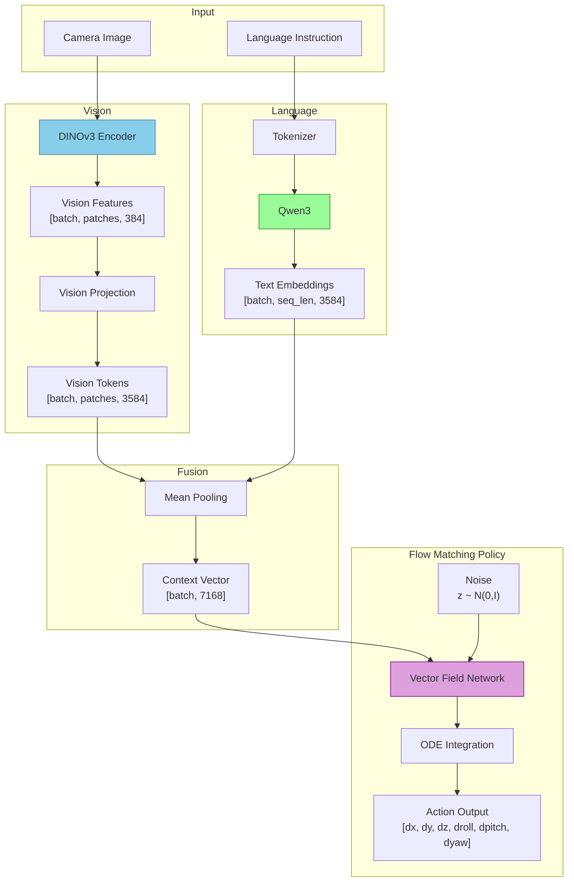

# Vision-Language-Action (VLA)

## The Math

### Vision Encoding

Extract visual features from camera observations:

```math
\mathbf{v} = \text{VisionEncoder}(\mathbf{I})
```

- $\mathbf{I}$: Input image (RGB)
- $\mathbf{v}$: Vision features $\in \mathbb{R}^{N \times d_v}$ (N patches, dimension $d_v$)

### Vision Projection

Project vision features to language model embedding space:

```math
\mathbf{v}' = \text{LayerNorm}(\mathbf{W}_2 \cdot \text{GELU}(\mathbf{W}_1 \mathbf{v}))
```

- $\mathbf{W}_1 \in \mathbb{R}^{d_h \times d_v}$: First projection layer
- $\mathbf{W}_2 \in \mathbb{R}^{d_l \times d_h}$: Second projection layer
- $\mathbf{v}' \in \mathbb{R}^{N \times d_l}$: Projected vision tokens

### Language Encoding

Encode the instruction text:

```math
\mathbf{e} = \text{LanguageModel}(\text{Tokenize}(\text{instruction}))
```

- $\mathbf{e}$: Text embeddings $\in \mathbb{R}^{T \times d_l}$ (T tokens)

### Context Fusion

Pool and concatenate vision and language features:

```math
\mathbf{c} = [\text{Pool}(\mathbf{v}') \| \text{Pool}(\mathbf{e})]
```

- $\mathbf{c}$: Context vector $\in \mathbb{R}^{2 \cdot d_l}$
- $\|$: Concatenation operation

### Flow Matching Policy

Learn a vector field that transforms noise to actions:

**Training**: Given target action $\mathbf{a}^*$ and noise $\boldsymbol{\epsilon} \sim \mathcal{N}(0, I)$:

```math
\mathbf{a}_t = (1-t) \boldsymbol{\epsilon} + t \mathbf{a}^*
```

The network predicts the velocity field:

```math
\hat{\mathbf{v}}_\theta(\mathbf{c}, \mathbf{a}_t, t) \approx \mathbf{a}^* - \boldsymbol{\epsilon}
```

**Loss function**:

```math
\mathcal{L} = \mathbb{E}_{t \sim U(0,1)} \left[ \| \hat{\mathbf{v}}_\theta(\mathbf{c}, \mathbf{a}_t, t) - (\mathbf{a}^* - \boldsymbol{\epsilon}) \|^2 \right]
```

**Inference**: Integrate the learned vector field from $t=0$ to $t=1$:

```math
\mathbf{a}_{t+\Delta t} = \mathbf{a}_t + \hat{\mathbf{v}}_\theta(\mathbf{c}, \mathbf{a}_t, t) \cdot \Delta t
```

## Implementation

### Vision Projection

| Step | Formula | Code |
| --- | --- | --- |
| 1 | $\mathbf{h} = \text{GELU}(\mathbf{W}_1 \mathbf{v})$ | `nn.Linear` → `nn.GELU()` |
| 2 | $\mathbf{v}' = \text{LayerNorm}(\mathbf{W}_2 \mathbf{h})$ | `nn.Linear` → `nn.LayerNorm` |

### Flow Matching Policy Network

| Step | Formula | Code |
| --- | --- | --- |
| 1 | Concatenate inputs | `input_tensor = torch.cat([context, noisy_action, time], dim=-1)` |
| 2 | MLP forward | `velocity = self.vector_field_network(input_tensor)` |

### Action Sampling (Euler Integration)

| Step | Formula | Code |
| --- | --- | --- |
| 1 | Initialize from noise | `action = torch.randn(batch_size, action_dimension)` |
| 2 | Predict velocity | `velocity = policy(context, action, current_time)` |
| 3 | Euler step | `action = action + velocity * delta_time` |

## Architecture



## Action Space

The policy outputs 6-DoF (Degrees of Freedom) actions for quadrotor control:

| Action | Symbol | Description |
| --- | --- | --- |
| Delta X | $\Delta x$ | Position change along X-axis |
| Delta Y | $\Delta y$ | Position change along Y-axis |
| Delta Z | $\Delta z$ | Position change along Z-axis (altitude) |
| Delta Roll | $\Delta \phi$ | Rotation around X-axis |
| Delta Pitch | $\Delta \theta$ | Rotation around Y-axis |
| Delta Yaw | $\Delta \psi$ | Rotation around Z-axis |
