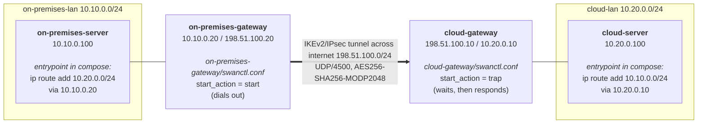
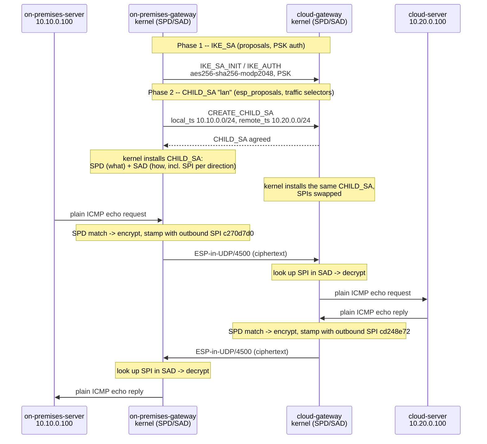

# IKEv2/IPsec

## What are IKEv2 and IPsec?

These are two separate protocols that work as a pair -- one negotiates, the other protects traffic.

- **IPsec** (Internet Protocol Security) is the suite that actually encrypts and authenticates IP
  traffic. Its data-plane protocol here is **ESP** (Encapsulating Security Payload): take a packet,
  encrypt its payload, wrap it in an ESP header/trailer. IPsec on its own says nothing about *how* the
  two sides agree on keys -- it just uses whatever keys and algorithm it's handed.
- **IKEv2** (Internet Key Exchange, version 2) is the protocol that supplies those keys. It's the
  handshake: the two gateways authenticate each other (here, with a pre-shared key) and negotiate
  which cipher, integrity algorithm, and key-exchange method to use, then derive the actual keys IPsec
  uses.

So "IKEv2/IPsec" describes one working tunnel made of two halves: IKEv2 sets it up, IPsec (via ESP)
carries the encrypted traffic once it's up. Everything below traces both halves end to end, from the
`swanctl.conf` directives that configure them, through the kernel tables that enforce them, to the
actual bytes on the wire.

## Topology

Two LANs that cannot otherwise reach each other, joined only by the tunnel across a simulated
public network (`198.51.100.0/24`, reserved for documentation by RFC 5737 so it cannot collide with
anything real):

## How it works

IKEv2 negotiates in two phases, and `swanctl.conf` has one block per phase:

- **IKE_SA** (`proposals`) authenticates the two gateways to each other and derives keys to protect the negotiation itself. Here that's a pre-shared key (`secrets { ike-site-to-site { ... } }`).
- **CHILD_SA** (`children { lan { esp_proposals ... } }`) is what actually encrypts application traffic. `local_ts` / `remote_ts` are the traffic selectors -- only packets between those two subnets are encrypted; everything else is unaffected. `modp2048` is Diffie-Hellman group 14; including a DH group in `esp_proposals` (not just `proposals`) is specifically what turns on perfect forward secrecy for the CHILD_SA.

Once the CHILD_SA is installed, the kernel enforces it through two tables you can inspect directly:

- `ip xfrm state` -- the Security Association Database (SAD): the actual negotiated keys, cipher,
  and SPI (Security Parameter Index) for each direction.
- `ip xfrm policy` -- the Security Policy Database (SPD): which traffic (by source/destination
  subnet) gets sent through a given SA, in the `out`, `in`, and `fwd` directions.

This split -- SPD decides *what* gets protected, SAD decides *how* -- is the core of how IPsec works
underneath any tool built on top of it.

- **IKE** -- Internet Key Exchange. The protocol that negotiates and authenticates -- the handshake.
- **SA** -- Security Association. An agreement between the two gateways on how to protect traffic in
  one direction: which cipher, which keys, which integrity algorithm. Comes in two kinds here:
  - **IKE_SA** -- protects the negotiation itself (phase 1).
  - **CHILD_SA** -- protects the actual application traffic (phase 2); the one here is named `lan`.
- **ESP** -- Encapsulating Security Payload. The wire format that does the actual encrypting: take a
  packet, encrypt its payload, wrap it in an ESP header/trailer.
- **SPI** -- Security Parameter Index. A number stamped in every ESP packet's header that labels
  which SA it belongs to, so the receiving kernel knows which key to decrypt it with. Each direction
  of a CHILD_SA gets its own SPI.
- **SAD** -- Security Association Database (`ip xfrm state`). *How* to protect traffic: the actual
  keys, cipher, and SPI for each installed SA.
- **SPD** -- Security Policy Database (`ip xfrm policy`). *What* to protect: which traffic, by
  source/destination subnet, gets sent through which SA.
- **DH** -- Diffie-Hellman. The key-exchange method the two gateways use to agree on a shared secret
  without ever sending it over the wire. `modp2048` is DH group 14.
- **PSK** -- Pre-Shared Key. The one shared secret both gateways already know, used here to
  authenticate the IKE_SA (see Notes below for why certificates are the more common alternative).

## Notes

- **Policy-based, not route-based.** Production IPsec deployments often bind a CHILD_SA to a virtual network interface (a route-based tunnel, e.g. Linux's XFRM interfaces) so ordinary routing decides what enters the tunnel. This setup uses classic policy-based IPsec instead, where the traffic selectors themselves decide -- partly because it is the clearer first lesson (the SPD is directly visible), and partly because route-based tunnels need kernel support (`CONFIG_XFRM_INTERFACE`) that some container runtimes do not build in.
- **Pre-shared key, not certificates.** A PSK keeps this setup to one shared secret instead of a certificate authority and per-gateway certificates. Production IKEv2 deployments more often use certificate authentication, since a PSK is a single point of compromise shared by both ends.
