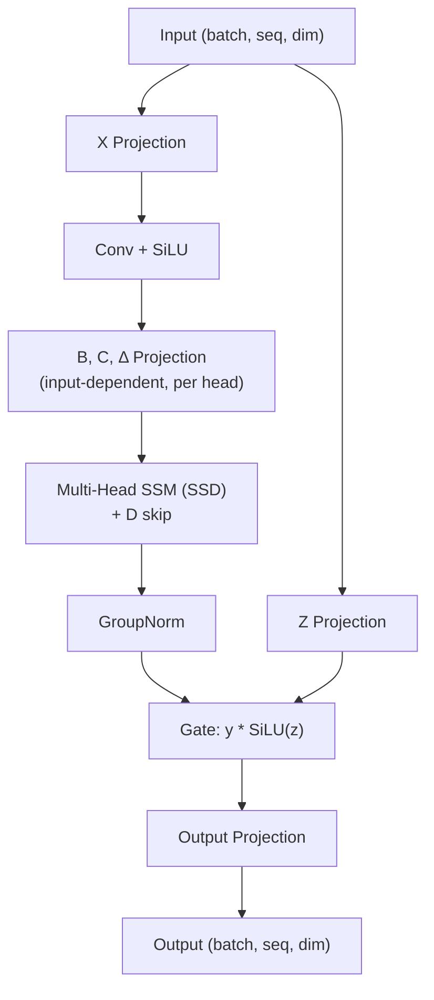

# Mamba 2

Mamba is a Selective State Space Model (SSM) that achieves linear-time sequence modeling by making SSM parameters input-dependent, allowing the model to selectively filter information.

This implementation is based on **Mamba 2**, which introduces State Space Duality (SSD) - showing SSMs are equivalent to a structured form of linear attention.

References:

- [Transformers are SSMs: Generalized Models and Efficient Algorithms Through Structured State Space Duality](https://arxiv.org/abs/2405.21060)

## Why Mamba?

| Model           | Complexity | Can Select Info | Parallel Training |
| --------------- | ---------- | --------------- | ----------------- |
| Transformer     | O(n²)      | Yes (attention) | Yes               |
| Traditional RNN | O(n)       | No              | No                |
| Traditional SSM | O(n)       | No              | Yes               |
| **Mamba**       | **O(n)**   | **Yes**         | **Yes**           |

Mamba combines the best of both worlds: linear complexity like RNNs, but with the ability to selectively focus on relevant information like Transformers.

## State Space Model Basics

A State Space Model maintains a hidden state $h$ that evolves over time:

```math
h_t = A h_{t-1} + B x_t \quad \text{(state update)}
```

```math
y_t = C h_t \quad \text{(output)}
```

Where:

- $x_t$ is the input at time $t$
- $h_t$ is the hidden state (memory)
- $y_t$ is the output
- $A$ controls how much previous state is retained (decay)
- $B$ controls how much input affects the state
- $C$ controls what part of the state is output

**Problem with traditional SSMs:** $A$, $B$, $C$ are fixed for all inputs, so the model cannot selectively remember or forget based on content.

## The Selective Mechanism

Mamba makes $B$, $C$, and $\Delta$ (discretization step) **input-dependent**:

```math
B_t = \text{Linear}(x_t), \quad C_t = \text{Linear}(x_t), \quad \Delta_t = \text{softplus}(\text{Linear}(x_t))
```

This allows the model to:

- **Large $\Delta$**: Let more input through (remember this token)
- **Small $\Delta$**: Ignore the current input (forget this token)
- **Varying $B$, $C$**: Control what aspects to store and retrieve

### Discretization

The continuous parameters are discretized for discrete sequences:

```math
\bar{A} = \exp(\Delta \cdot A), \quad \bar{B} = \Delta \cdot B
```

## Mamba 2: State Space Duality (SSD)

The key insight of Mamba 2 is that SSMs are equivalent to linear attention:

```math
y = (L \odot (C B^T)) X
```

Where $L$ is a causal decay mask:

```math
L[i,j] = \exp\left(\sum_{k=j}^{i} \Delta_k \cdot A\right) \quad \text{for } i \geq j
```

**Key differences from Mamba 1:**

| Aspect        | Mamba 1           | Mamba 2                       |
| ------------- | ----------------- | ----------------------------- |
| A parameter   | Diagonal matrix   | Scalar per head               |
| Structure     | Single path       | Multi-head (like attention)   |
| Speed         | Fast              | 2-8x faster                   |
| Theory        | SSM only          | SSM = Linear Attention        |

## Mamba 2 Block Architecture



## Example: Selective Copying Task

The `main.py` demonstrates Mamba learning a selective copying task:

```text
Input:  [7, 3, COPY, 5, 9, COPY, 2, 4]
Target: [_, _, _,    5, _, _,    2, _]
```

The model learns to:

1. Recognize `COPY` markers → increase $\Delta$ to "open the gate"
2. Store the next token in state → adjust $B$ to write to memory
3. Output the stored token → adjust $C$ to read from memory
4. Ignore other tokens → keep $\Delta$ small

## Full Mamba Block (with Residual)

In practice, Mamba blocks include LayerNorm and residual connections:

```math
\text{output} = \text{input} + \text{Mamba}(\text{LayerNorm}(\text{input}))
```
