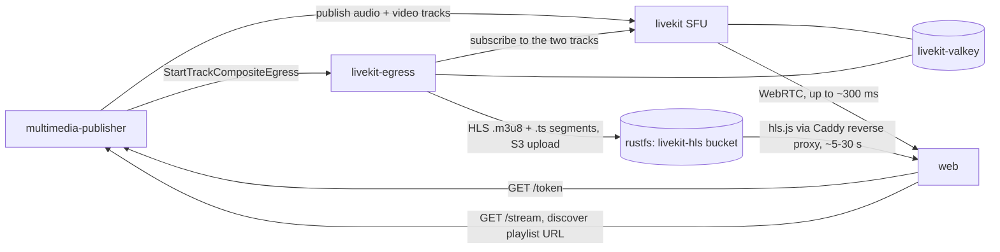

# LiveKit

```mermaid
flowchart LR
    Publisher[multimedia-publisher] -->|publish audio + video tracks| LiveKit[livekit SFU]
    Publisher -->|StartTrackCompositeEgress| Egress[livekit-egress]
    LiveKit --- Valkey[(livekit-valkey)]
    Egress --- Valkey
    Egress -->|subscribe to the two tracks| LiveKit
    Egress -->|HLS .m3u8 + .ts segments, S3 upload| RustFS[(rustfs: livekit-hls bucket)]

    Web[web] -->|GET /token| Publisher
    Web -->|GET /stream, discover playlist URL| Publisher
    LiveKit -->|WebRTC, up to ~300 ms| Web
    RustFS -->|hls.js via Caddy reverse proxy, ~5-30 s| Web
```
