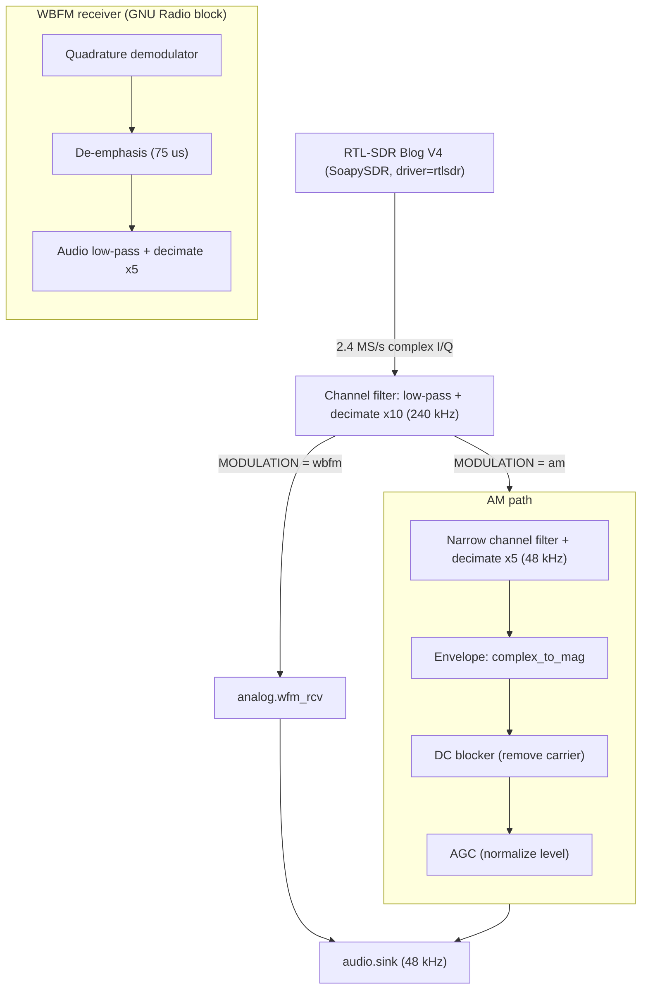

# GNU Radio Receiver

## Architecture

```mermaid
flowchart TD
  Dongle["RTL-SDR Blog V4 (SoapySDR, driver=rtlsdr)"] -->|"2.4 MS/s complex I/Q"| Channel["Channel filter: low-pass + decimate x10 (240 kHz)"]
  Channel -->|"MODULATION = wbfm"| WBFM["analog.wfm_rcv"]
  Channel -->|"MODULATION = am"| AM

  subgraph WBFMInternals["WBFM receiver (GNU Radio block)"]
    direction TB
    Demod["Quadrature demodulator"]
    Deemph["De-emphasis (75 us)"]
    AudioLowpass["Audio low-pass + decimate x5"]
    Demod --> Deemph --> AudioLowpass
  end

  subgraph AM["AM path"]
    direction TB
    Narrow["Narrow channel filter + decimate x5 (48 kHz)"]
    Envelope["Envelope: complex_to_mag"]
    DcBlock["DC blocker (remove carrier)"]
    Agc["AGC (normalize level)"]
    Narrow --> Envelope --> DcBlock --> Agc
  end

  WBFM --> Audio["audio.sink (48 kHz)"]
  AM --> Audio
```
