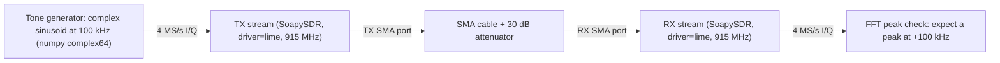

# LimeSDR Transceiver

## Architecture

```mermaid
flowchart LR
  Tone["Tone generator: complex sinusoid at 100 kHz (numpy complex64)"] -->|"4 MS/s I/Q"| TxStream["TX stream (SoapySDR, driver=lime, 915 MHz)"]
  TxStream -->|"TX SMA port"| Loopback["SMA cable + 30 dB attenuator"]
  Loopback -->|"RX SMA port"| RxStream["RX stream (SoapySDR, driver=lime, 915 MHz)"]
  RxStream -->|"4 MS/s I/Q"| Fft["FFT peak check: expect a peak at +100 kHz"]
```
