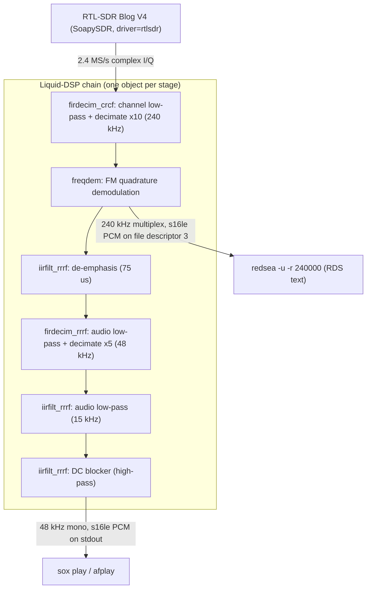

# Liquid-DSP Receiver

## Architecture

```mermaid
flowchart TD
  Dongle["RTL-SDR Blog V4 (SoapySDR, driver=rtlsdr)"] -->|"2.4 MS/s complex I/Q"| Channel

  subgraph Liquid["Liquid-DSP chain (one object per stage)"]
    direction TB
    Channel["firdecim_crcf: channel low-pass + decimate x10 (240 kHz)"]
    Demod["freqdem: FM quadrature demodulation"]
    Deemph["iirfilt_rrrf: de-emphasis (75 us)"]
    AudioDecim["firdecim_rrrf: audio low-pass + decimate x5 (48 kHz)"]
    AudioLowpass["iirfilt_rrrf: audio low-pass (15 kHz)"]
    DcBlock["iirfilt_rrrf: DC blocker (high-pass)"]
    Channel --> Demod --> Deemph --> AudioDecim --> AudioLowpass --> DcBlock
  end

  DcBlock -->|"48 kHz mono, s16le PCM on stdout"| Player["sox play / afplay"]
  Demod -->|"240 kHz multiplex, s16le PCM on file descriptor 3"| Redsea["redsea -u -r 240000 (RDS text)"]
```
