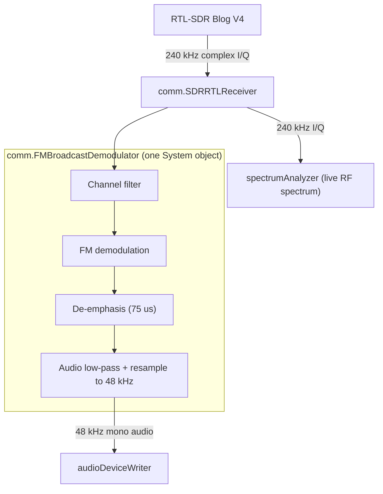

# MATLAB Receiver

## Architecture

```mermaid
flowchart TD
  Dongle["RTL-SDR Blog V4"] -->|"240 kHz complex I/Q"| Receiver["comm.SDRRTLReceiver"]

  subgraph Demod["comm.FMBroadcastDemodulator (one System object)"]
    direction TB
    Channel["Channel filter"]
    FmDemod["FM demodulation"]
    Deemph["De-emphasis (75 us)"]
    Resample["Audio low-pass + resample to 48 kHz"]
    Channel --> FmDemod --> Deemph --> Resample
  end

  Receiver --> Channel
  Resample -->|"48 kHz mono audio"| Player["audioDeviceWriter"]
  Receiver -->|"240 kHz I/Q"| Scope["spectrumAnalyzer (live RF spectrum)"]
```
