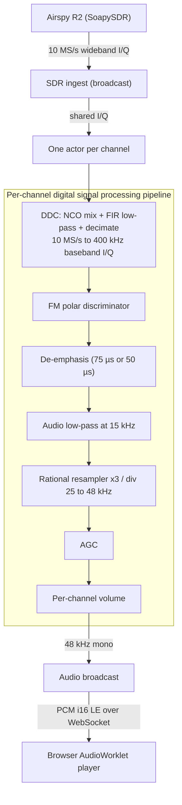

# Radio Streamer

## Architecture



## Digital Down-Converter (DDC) Math (Polyphase Frequency Translation)

The DDC searches a wide capture (e.g. 10 MS/s centred at 94.9 MHz) for one narrow FM station (e.g. Bay Country at 94.5 MHz, ~200 kHz wide), shifts it to DC, low-pass filters, and decimates down to 400 kS/s. Three logical steps:

**Step 1 — NCO mix** shifts the channel to DC:

```math
\text{mixed}[n] = \text{input}[n] \cdot e^{-j \omega n}
```

where:

- $n$ — input sample index (running at the SDR's input rate $F_s$)
- $\text{input}[n]$ — complex I/Q sample from the SDR
- $\omega = 2\pi \Delta f / F_s$ — NCO angular frequency, radians per sample
- $\Delta f$ — channel offset from the capture centre, in Hz (e.g. $94.5\text{ MHz} - 94.9\text{ MHz} = -0.4\text{ MHz}$)
- $F_s$ — input sample rate (e.g. 10 MS/s)

Multiplying by a rotating complex phasor translates the whole spectrum by $-\Delta f$.

**Step 2 — FIR low-pass** with real taps $h[k]$ (windowed sinc, 257 taps, cut-off ~100 kHz — full broadcast FM Carson bandwidth). Keeps the channel, rejects everything else.

- $k$ — tap index, $0 \le k < 257$
- $h[k]$ — real filter coefficient (precomputed at construction)

**Step 3 — Decimate** by $M = F_{s,\text{in}} / F_{s,\text{out}}$ — keep every $M$-th sample (e.g. $M = 25$ for 10 MS/s → 400 kS/s).

### Fusing Mix + Filter + Decimate

Composing the three steps directly:

```math
y[m] = \sum_k h[k] \cdot \text{mixed}[mM + k] = \sum_k h[k] \cdot \text{input}[mM + k] \cdot e^{-j \omega (mM + k)}
```

where:

- $m$ — output sample index (running at $F_{s,\text{out}} = F_s / M$)
- $y[m]$ — complex narrowband output sample at output index $m$
- $mM$ — input sample index where output $m$'s FIR window starts
- $k$ — tap index inside the FIR window, summed over all 257 taps

Split the exponential:

```math
e^{-j \omega (mM + k)} = e^{-j \omega m M} \cdot e^{-j \omega k}
```

Substitute back and pull the $m$-only term out of the sum:

```math
y[m] = e^{-j \omega m M} \cdot \sum_k \underbrace{\left[ h[k] \cdot e^{-j \omega k} \right]}_{c[k]} \cdot \text{input}[mM + k]
```

Define **complex bandpass taps** $c[k] = h[k] \cdot e^{-j \omega k}$, precomputed once at construction. The real low-pass $h[k]$ becomes a complex filter whose pass-band sits at $-\omega$ instead of 0 — selecting the channel and shifting it to DC in one operation, with no explicit NCO step at the input rate.

The remaining $e^{-j \omega m M}$ is a **per-output phasor** that advances by $e^{-j \omega M}$ each output sample:

```math
\phi_{m+1} = \phi_m \cdot e^{-j \omega M}, \quad y[m] = \phi_m \cdot \sum_k c[k] \cdot \text{input}[n_w(m) + k]
```

where:

- $c[k] = h[k] \cdot e^{-j \omega k}$ — complex bandpass tap, precomputed at construction
- $n_w(m)$ — absolute input index where output $m$'s FIR window starts
- $\phi_m = e^{-j \omega \, n_w(m)}$ — per-output phasor that undoes the window-start phase reference
- $e^{-j \omega M}$ — fixed phasor step, precomputed; multiplies $\phi_m$ after each output

Implementation detail: each chunk's FIR window is fed an `FIR_LEN - 1` zero-padded history before the first real sample, so $n_w(0) = -(FIR\_LEN - 1)$ at startup, and $\phi_0 = e^{j \omega (FIR\_LEN - 1)}$ rather than $1$. This is a constant phase rotation across all outputs — FM demodulation cares only about phase *differences* between successive samples, so the absolute reference doesn't affect the recovered audio.

`sin_cos` is evaluated only at construction (once per tap, plus a few for phasor setup). The hot path is one complex-complex MAC per tap per output, plus one phasor multiply per output. There is no input-rate intermediate buffer.

The phasor accumulates f32 magnitude drift over many multiplies. The implementation renormalises ($\phi \mathrel{/}= |\phi|$) once per chunk when $\bigl| |\phi|^2 - 1 \bigr| > 10^{-6}$ — a few `sqrt`s per second, negligible.

## FM Demodulation (Polar Discriminator)

A frequency-modulated signal at baseband is

```math
z[n] = A[n] \cdot e^{j \phi[n]}
```

where:

- $A[n]$ — amplitude (varies with signal strength and fading; FM is amplitude-independent so we discard it)
- $\phi[n]$ — instantaneous phase (carries the audio)

The information lives in the **instantaneous frequency**, which is the time derivative of the phase. In discrete time, that's the per-sample phase delta:

```math
\Delta\phi[n] = \phi[n] - \phi[n-1]
```

Computing $\phi[n]$ explicitly with `atan2` and subtracting introduces a $2\pi$-wrap problem at the discontinuity. Instead, compute the delta from the complex product:

```math
z[n] \cdot z^*[n-1] = A[n] A[n-1] \cdot e^{j(\phi[n] - \phi[n-1])}
```

```math
\Delta\phi[n] = \arg\bigl( z[n] \cdot z^*[n-1] \bigr) = \mathrm{atan2}\bigl( \Im(z[n] z^*[n-1]),\, \Re(z[n] z^*[n-1]) \bigr)
```

where:

- $z^*[n-1]$ — complex conjugate of the previous sample
- $\arg(\cdot)$ — argument (angle) of a complex number, returned in $(-\pi, \pi]$

`atan2` returns the wrapped phase difference natively, so there is no unwrap step. One complex multiply plus one `atan2` per sample.

The output is normalised so peak deviation maps to $\pm 1.0$:

```math
\text{audio}[n] = \frac{\Delta\phi[n]}{\omega_\text{max}}, \quad \omega_\text{max} = \frac{2\pi f_\text{dev}}{F_s}
```

where:

- $f_\text{dev}$ — peak deviation (e.g. 75 kHz for broadcast FM)
- $F_s$ — sample rate of the demod input (the DDC's output rate, e.g. 400 kS/s)
- $\omega_\text{max}$ — phase step per sample at peak deviation

## De-Emphasis

Broadcast FM transmitters apply **pre-emphasis** — a 1st-order high-pass that boosts high audio frequencies before modulation, so the received signal has lower hiss after equal-and-opposite **de-emphasis** at the receiver. The de-emphasis filter is a single-pole IIR low-pass with time constant $\tau$:

```math
\alpha = e^{-1 / (\tau F_s)}, \quad y[n] = (1 - \alpha) \cdot x[n] + \alpha \cdot y[n-1]
```

where:

- $\tau$ — time constant in seconds; 75 µs in the Americas and Korea ($-3$ dB at $\approx 2.12$ kHz), 50 µs elsewhere ($\approx 3.18$ kHz)
- $\alpha$ — feedback coefficient (close to 1 since $\tau F_s \gg 1$)
- $1 - \alpha$ — feedforward coefficient

The $-3$ dB corner is $f_c = 1 / (2\pi\tau)$. Without de-emphasis, FM broadcast audio sounds harsh and hissy because the transmitter's pre-emphasis remains in the signal.

## Rational Resampler (Polyphase L/M)

Converting between two sample rates whose ratio is $L/M$ in lowest terms (e.g. 400 kHz → 48 kHz: $L=3$, $M=25$). Conceptually:

1. **Up-sample** by $L$ — insert $L-1$ zeros between every input sample.
2. **Low-pass** at $\min(F_{s,\text{in}}, F_{s,\text{out}})/2$ to remove the imaging copies.
3. **Down-sample** by $M$ — keep every $M$-th sample.

The naive implementation wastes work on the inserted zeros and on samples that will be discarded. The polyphase reorganisation skips both.

The prototype low-pass has $L \cdot N$ taps. Split it into $L$ phase banks where bank $p$ contains taps $p, p+L, p+2L, \dots$ — each bank has $N$ taps. For output sample index $n$:

```math
p = (n M) \bmod L, \quad i = \lfloor n M / L \rfloor
```

```math
y[n] = \sum_{k=0}^{N-1} \text{bank}_p[k] \cdot x[i - k]
```

where:

- $p$ — selected phase bank, $0 \le p < L$
- $i$ — input sample index that aligns with this output
- $\text{bank}_p[k]$ — $k$-th tap of phase bank $p$
- $N$ — taps per phase (32 in this implementation)

No zero multiplies, no discarded outputs — just one $N$-tap convolution per output sample, with the bank selection rotating through $L$ phases.

## AGC (Audio Automatic Gain Control)

FM demod output level varies with **modulation depth** (a heavily modulated station is loud, a soft-spoken one is quiet) but not with received signal strength (FM is amplitude-independent). AGC adapts to that variation by tracking the audio envelope and applying a gain that lands it on a fixed target.

### Envelope Tracker (Asymmetric One-Pole)

```math
e[n] = \begin{cases} \alpha_\text{attack} \cdot e[n-1] + (1 - \alpha_\text{attack}) \cdot |x[n]| & \text{if } |x[n]| > e[n-1] \quad (\text{rising}) \\ \alpha_\text{release} \cdot e[n-1] + (1 - \alpha_\text{release}) \cdot |x[n]| & \text{otherwise} \quad (\text{falling}) \end{cases}
```

where:

- $|x[n]|$ — instantaneous sample magnitude
- $e[n]$ — tracked envelope (persistent state)
- $\alpha_\text{attack} = e^{-1 / (\tau_\text{attack} F_s)}$ — coefficient for rising envelope (fast, $\tau_\text{attack} \approx 10$ ms)
- $\alpha_\text{release} = e^{-1 / (\tau_\text{release} F_s)}$ — coefficient for falling envelope (slow, $\tau_\text{release} \approx 300$ ms)

Fast attack catches transients (a sudden loud passage doesn't clip). Slow release stops the gain from "pumping" during quiet passages between syllables.

### Gain Selection and Smoothing

```math
g_\text{target}[n] = \mathrm{clamp}\left( \frac{T}{\max(e[n],\, \epsilon)},\, 0.1,\, g_\text{max} \right)
```

```math
g[n] = \alpha_\text{gain} \cdot g[n-1] + (1 - \alpha_\text{gain}) \cdot g_\text{target}[n]
```

```math
y[n] = g[n] \cdot x[n]
```

where:

- $T$ — target envelope (0.25 in this implementation; sits below 0 dBFS with headroom)
- $g_\text{max}$ — gain ceiling (8 in this implementation; stops silence from being amplified to noise ceiling)
- $\epsilon$ — small floor on envelope to avoid divide-by-zero
- $\alpha_\text{gain} = e^{-1 / (\tau_\text{gain} F_s)}$ — gain-smoothing coefficient ($\tau_\text{gain} \approx 30$ ms)

The gain itself is smoothed (separately from the envelope) so the output doesn't audibly bounce sample to sample. Three time constants, three independent poles — envelope attack, envelope release, gain smoothing.
