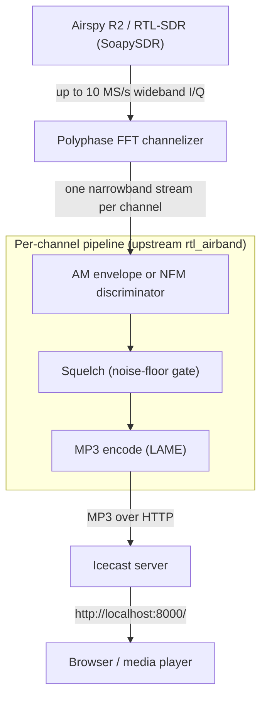

# RTLSDR-Airband

## Architecture



## Polyphase FFT Channelizer

A single wide capture (for example 10 MS/s centered at 123 MHz, covering 118-128 MHz) contains many
voice channels at once. Rather than running a separate down-converter per channel, rtl_airband uses
a polyphase FFT channelizer: one FFT splits the whole capture into a bank of evenly spaced frequency
bins, and each configured channel is read from the bin nearest its frequency.

For an $N$-point FFT on input $x$, bin $k$ is

```math
X[k] = \sum_{n=0}^{N-1} x[n] \cdot e^{-j 2\pi k n / N}
```

where:

- $N$ - FFT size (the number of frequency bins across the capture bandwidth)
- $k$ - bin index, $0 \le k < N$
- $X[k]$ - complex output for bin $k$, centered at frequency $k \cdot F_s / N$ from the capture edge
- $F_s$ - capture sample rate

Each bin is spaced $F_s / N$ apart and carries a decimated complex stream for that slice of
spectrum. The "polyphase" prepass applies a windowed prototype low-pass filter, split into $N$ phase
banks, so adjacent bins do not leak into one another - the same polyphase idea used in the
[`radio-streamer` resampler](../radio-streamer/README.md), here applied to channel separation rather
than rate conversion. The cost is one shared FFT for all channels instead of one mixer-and-filter per
channel.

## AM Demodulation (Envelope Detection)

Aviation voice is amplitude modulated: the audio rides in the magnitude of the carrier. With a
complex baseband sample $z[n] = I[n] + j\,Q[n]$, the recovered audio is the envelope

```math
a[n] = |z[n]| = \sqrt{I[n]^2 + Q[n]^2}
```

where:

- $I[n], Q[n]$ - in-phase and quadrature components of the channel sample
- $a[n]$ - recovered audio amplitude

A DC-blocking high-pass then removes the carrier's constant term, leaving the voice signal. No phase
information is needed - AM ignores it entirely.

## NFM Demodulation (Polar Discriminator)

For narrowband FM channels (`modulation = "nfm"`), the information is in the **instantaneous
frequency**, which is the per-sample phase change. Computing the phase difference from the complex
product avoids the $2\pi$ wrap that explicit `atan2`-and-subtract would hit:

```math
\Delta\phi[n] = \arg\bigl( z[n] \cdot z^*[n-1] \bigr) = \mathrm{atan2}\bigl( \Im(z[n] z^*[n-1]),\, \Re(z[n] z^*[n-1]) \bigr)
```

where:

- $z^*[n-1]$ - complex conjugate of the previous sample
- $\Delta\phi[n]$ - wrapped phase delta, proportional to the recovered audio
- $\arg(\cdot)$ - argument (angle) of a complex number, returned in $(-\pi, \pi]$

This is the same polar discriminator that [`radio-streamer`](../radio-streamer/README.md#fm-demodulation-polar-discriminator)
uses for broadcast FM; the only difference is the narrower channel bandwidth.

## Squelch (Noise-Floor Gate)

Push-to-talk voice channels are silent most of the time, so each channel is gated by a squelch that
only passes audio when a real signal is present. rtl_airband tracks a running estimate of the channel
power and compares it against a threshold:

```math
P[n] = \beta \cdot P[n-1] + (1 - \beta) \cdot |z[n]|^2, \quad \text{open if } 10\log_{10} P[n] > T
```

where:

- $P[n]$ - smoothed channel power estimate
- $\beta$ - smoothing coefficient (close to 1; longer memory means a steadier floor)
- $T$ - squelch threshold in dB (`squelch_threshold`), or an adaptive value when
  `squelch_threshold_auto = true` continuously estimates the noise floor

When the estimate falls below the threshold the gate closes and no audio is emitted - that is why a
push-to-talk channel produces files (or stream data) only while keyed, while an always-on ATIS loop
stays open continuously.
