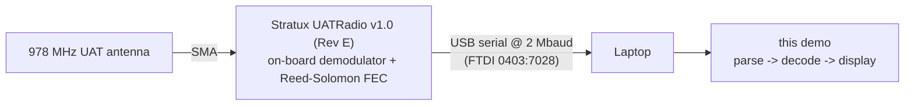

# Stratux UAT Receiver

Decode live **978 MHz UAT ADS-B** traffic from a **Stratux UATRadio v1.0 (Rev E)**
plugged into a laptop over USB, and pretty-print each aircraft's position,
altitude, speed, track, and call sign.

UAT (Universal Access Transceiver) is the 978 MHz ADS-B link used by general
aviation in the US, carrying both aircraft position reports (downlink) and
ground-broadcast weather and traffic, FIS-B / TIS-B (uplink). It is separate
from the 1090 MHz Mode S Extended Squitter link.

## Hardware



The radio does the RF demodulation and forward-error-correction in firmware, then
streams already-decoded UAT frames as text lines over a USB-serial bridge at
**2,000,000 baud**. This demo never touches I/Q samples; it only parses and
decodes the frames the radio hands up.

## Serial line format

The radio emits one line per frame, in the [dump978](https://github.com/cyoung/stratux/tree/master/dump978)
text convention:

```
-0a8e1bc1d2...;rs=2;rssi=-21.5;     downlink (aircraft) frame, '-' prefix
+1f3c...;rs=0;                      uplink (ground broadcast) frame, '+' prefix
```

The hex after the prefix is the frame payload; everything after the first `;`
is `key=value` metadata (`rs` = corrected Reed-Solomon byte errors, `rssi`).
[parse_uat_line.py](src/parse_uat_line.py) splits these apart.

## Downlink decoding

A downlink frame is a DO-282B UAT ADS-B message: 18 bytes (short) or 34 bytes
(long, includes the call sign). [decode_uat_downlink.py](src/decode_uat_downlink.py)
implements the bit-level decode from the
[cyoung/stratux uat_decode.c](https://github.com/cyoung/stratux/blob/master/dump978/uat_decode.c)
reference.

Latitude and longitude are packed as a fraction of a full circle:

```math
\text{lat} = \text{raw}_{\text{lat}} \cdot \frac{360}{2^{24}}, \quad
\text{lon} = \text{raw}_{\text{lon}} \cdot \frac{360}{2^{24}}
```

where `raw_lat` is 23 bits and `raw_lon` is 24 bits; values past the half-circle
wrap into the southern / western hemisphere. Pressure altitude uses 25 ft steps
offset 1000 ft below sea level:

```math
\text{altitude}_{\text{ft}} = (\text{raw}_{\text{alt}} - 1)\cdot 25 - 1000
```

Ground speed and track come from signed north/south and east/west velocity
components:

```math
\text{speed} = \sqrt{v_{ns}^2 + v_{ew}^2}, \quad
\text{track} = \left(450 - \operatorname{atan2}(v_{ns}, v_{ew})\cdot\tfrac{180}{\pi}\right) \bmod 360
```

The 8-character call sign and emitter category in a long frame are base-40
packed three characters per 16-bit word; [decode_call_sign.py](src/decode_call_sign.py)
unpacks them.

## Run it

```sh
just install-dependencies

# Decode live traffic from the radio (auto-detects the serial port)
just dev

# No radio attached? Replay synthetic frames through the full decode path
just simulate

just test
```

Example output:

```
[A1B2C3] N172SP     37.6213, -122.3790   4500 ft 145 kt  90 deg AIRBORNE_SUBSONIC
  totals: 1 downlink, 0 uplink, 1 unique aircraft
```

Pass an explicit port with `uv run python src/main.py --port /dev/cu.usbserial-XXXX`.

## macOS notes

After plugging in the radio, confirm the OS created a serial device:

```sh
ls /dev/cu.usbserial-* /dev/cu.wchusbserial-*
```

If nothing appears, the USB-serial bridge driver is missing. Recent macOS ships
built-in FTDI and CH34x DriverKit drivers; if your board uses a different bridge,
install the vendor driver, then re-check. The demo auto-detects the FTDI
`0403:7028` Stratux ID first and falls back to any `usbserial` / `wchusbserial`
device.

## Layout

| File | Responsibility |
| --- | --- |
| [main.py](src/main.py) | CLI entry, live vs simulate, aircraft display |
| [find_stratux_serial_port.py](src/find_stratux_serial_port.py) | Auto-detect the radio's serial port |
| [read_uat_messages.py](src/read_uat_messages.py) | Stream parsed frames off the serial port |
| [parse_uat_line.py](src/parse_uat_line.py) | Split a dump978 text line into payload + metadata |
| [decode_uat_downlink.py](src/decode_uat_downlink.py) | Bit-level UAT ADS-B downlink decode |
| [decode_call_sign.py](src/decode_call_sign.py) | Base-40 call sign + emitter category |
| [encode_uat_downlink.py](src/encode_uat_downlink.py) | Inverse encoder (used by simulate + tests) |
| [simulate_uat_stream.py](src/simulate_uat_stream.py) | Synthetic frame source |
| [models.py](src/models.py) / [constants.py](src/constants.py) | Pydantic models, enums, constants |
| [smoke_test.py](src/smoke_test.py) | Round-trip encode/decode + parser tests |
